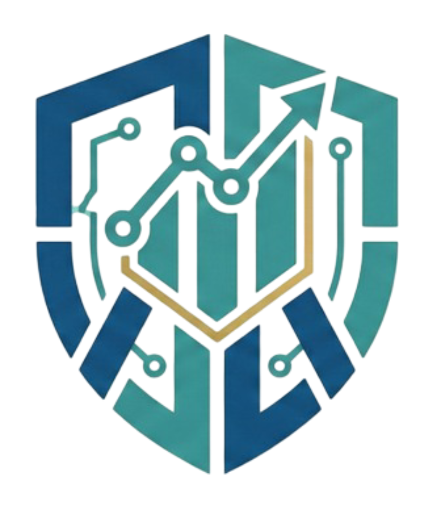

# AccSys: Web-Based Integrated Accounting & Financial Management System

<p align="center">
  
</p>

> A modern, comprehensive web-based accounting system that automates financial processes and provides real-time insights for businesses.

[](https://dotnet.microsoft.com/)
[](https://dotnet.microsoft.com/apps/aspnet/web-apps/blazor)
[](https://www.microsoft.com/sql-server)

## 📋 Overview

**AccSys** is an enterprise-grade accounting and financial management system designed to streamline and automate bookkeeping, financial reporting, and transaction management. Built with modern web technologies, it provides a secure, scalable, and user-friendly platform for organizations to manage their financial operations efficiently.

### 🎯 Key Features

- **Automated Double-Entry Bookkeeping** - Automatic generation of accurate journal entries for every transaction
- **Bills & Invoice Management** - Seamless creation and tracking of vendor bills and customer invoices
- **Financial Reporting** - Real-time generation of Trial Balance, Income Statement, and Balance Sheet
- **Payment Integration** - Online payment processing through PayMongo API
- **Real-Time Economic Data** - Integration with World Bank API for Philippine inflation rates
- **Currency Exchange Rates** - Live forex data via Frankfurter API
- **Role-Based Access Control** - Secure multi-user environment with granular permissions
- **Audit Trail** - Comprehensive logging of all critical system actions

## 🏗️ System Architecture

### Technology Stack

#### Frontend
- **Framework**: Blazor WebAssembly (WASM) with .NET 8
- **UI Library**: MudBlazor
- **Client-Side Routing**: Protected routes with authorization guards

#### Backend
- **API Framework**: ASP.NET Core 8 Web API
- **Database**: Microsoft SQL Server 2022
- **ORM**: Entity Framework Core
- **Authentication**: JWT (JSON Web Tokens)
- **API Documentation**: Swagger UI

#### Reporting & Integration
- **PDF Generation**: QuestPDF
- **Payment Gateway**: PayMongo API
- **Economic Data**: World Bank Open Data API
- **Currency Exchange**: Frankfurter API

## 🔐 Security Features

- **JWT Authentication** - Stateless token-based authentication
- **Role-Based Authorization** - Admin, Accountant, and Manager roles with specific permissions
- **Password Security** - SHA-256 hashing for all user credentials
- **Audit Logging** - Middleware-based tracking of POST/PUT/DELETE operations
- **Route Protection** - Client-side authorization guards

## 👥 User Roles & Permissions

### Administrator
- ✅ Full system access and configuration
- ✅ User account management and role assignments
- ✅ Complete access to all financial modules
- ✅ Full reporting capabilities

### Accounting Staff
- ✅ Chart of Accounts management
- ✅ Journal entry creation and management
- ✅ Accounts Payable/Receivable transactions
- ✅ Financial dashboard viewing
- ✅ Report generation and export
- ❌ No user management access

### Management
- ✅ Financial dashboard access
- ✅ Report generation, printing, and export
- ❌ No transaction management
- ❌ No system configuration access

## 📊 Core Modules

### 1. User Management Module
- User registration and role assignment (Admin only)
- Access control management
- User activity monitoring

### 2. General Ledger (GL) Module
- Chart of Accounts management
- Manual journal entry processing
- Automated trial balance calculation

### 3. Accounts Payable (AP) Module
- Vendor management (CRUD operations)
- Bill recording and expense classification
- Outgoing payment tracking

### 4. Accounts Receivable (AR) Module
- Customer management (CRUD operations)
- Invoice generation and delivery
- Digital payment processing via PayMongo

### 5. Financial Reporting Module
- Dynamic KPI dashboard with charts
- Statement of Financial Position (Balance Sheet)
- Statement of Comprehensive Income (Income Statement)
- Export to PDF format

## 🚀 Getting Started

### Prerequisites

- Visual Studio 2022 or later
- .NET 8 SDK
- Microsoft SQL Server 2022
- SQL Server Management Studio (SSMS)
- Git
- Modern web browser (Chrome, Edge, or Firefox)

### Installation

1. **Clone the repository**
```bash
git clone https://github.com/dev-aziii/accsys.git
cd accsys
```

2. **Setup Database**
```bash
# Configure secrets with user-secrets or environment variables
# See SECURITY_CONFIGURATION.md for the required keys and example commands
cd AccountingSystem.Api
```

3. **Configure API Keys**
```bash
# Do not store secrets in committed appsettings.json
# Follow SECURITY_CONFIGURATION.md for local Development and production setup
```

4. **Run the Application**
```bash
# Start the API
cd AccountingSystem.Api
dotnet run

# Start the Blazor WASM app
cd ../AccountingSystem.Client
dotnet run
```

5. **Access the Application**
- API: `https://localhost:7001`
- Swagger UI: `https://localhost:7001/swagger`
- Client: `https://localhost:7002`

## 📸 Screenshots

*Coming soon - Dashboard, Invoice Management, Financial Reports*

## 🎯 Project Objectives

- Centralize all financial processes (AP, AR, GL) in one unified database
- Automate double-entry bookkeeping to reduce manual errors
- Provide secure, web-based access for authorized staff across the network
- Ensure accounting accuracy following the fundamental equation: **Assets = Liabilities + Equity**
- Enable real-time financial insights 

## 👨‍💻 Developer

**Adzyl Hilary A. Jipos**  
BS Information Technology Student  
University of Mindanao, Davao City

[](https://www.facebook.com/adzyl.jps/)
[](https://github.com/dev-aziii)

## 🙏 Acknowledgments

- University of Mindanao - College of Computer Education
- Sir Michael Kevin Hernandez - Subject Instructor, IT15L
- MudBlazor Community
- QuestPDF Documentation
- PayMongo Developer Resources

## 📞 Support

For issues, questions, or contributions, please open an issue in the GitHub repository or contact me directly.

---

<p align="center">
  <i>Built with ❤️ for modern financial management</i>
</p>
